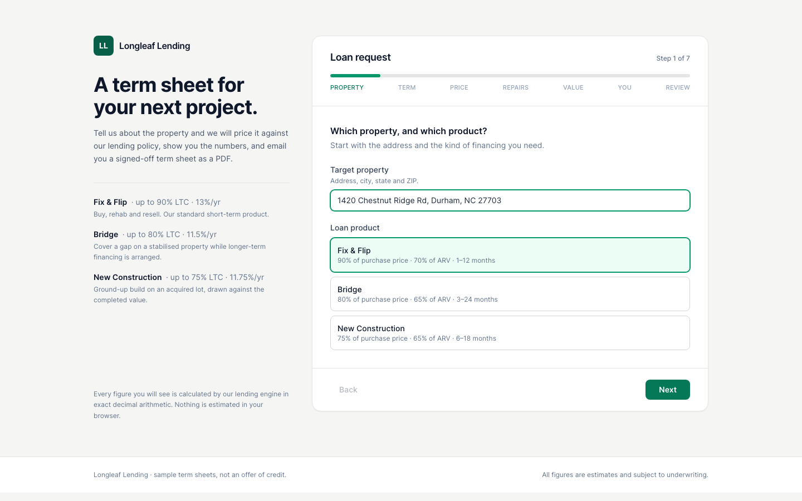
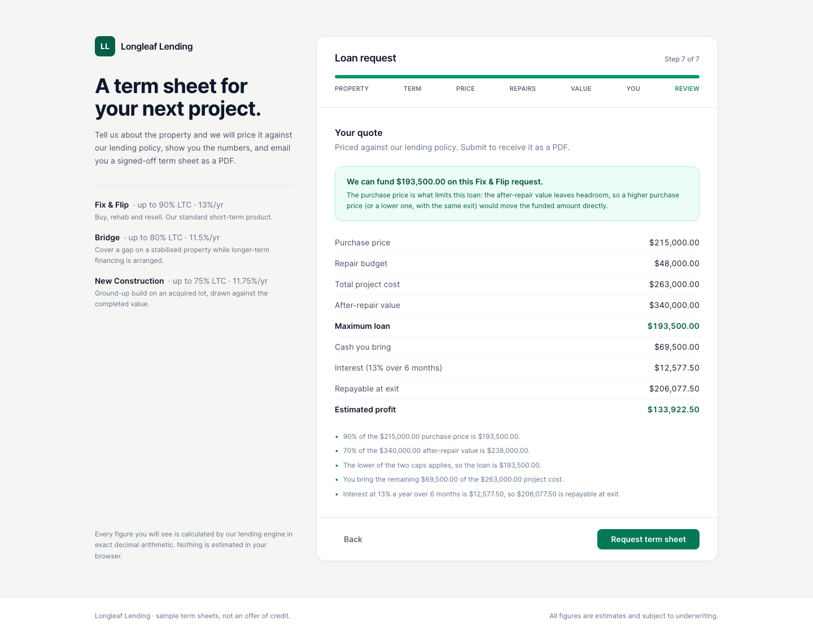
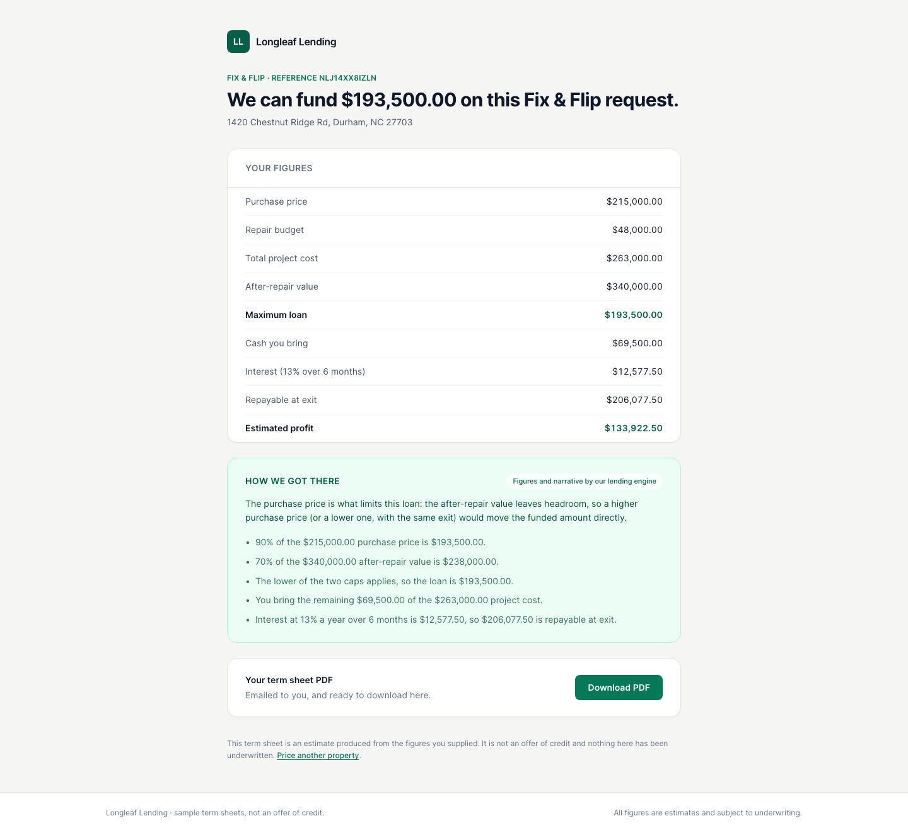
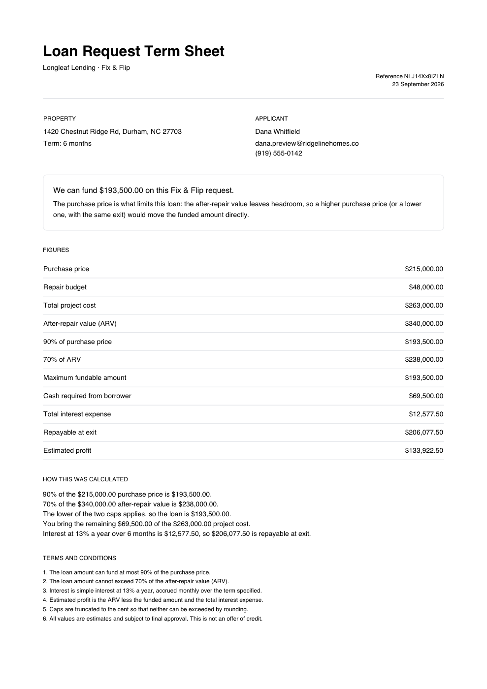
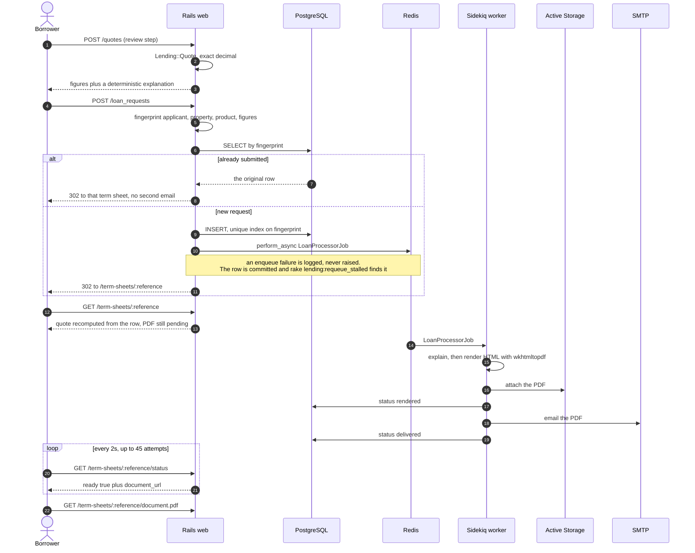
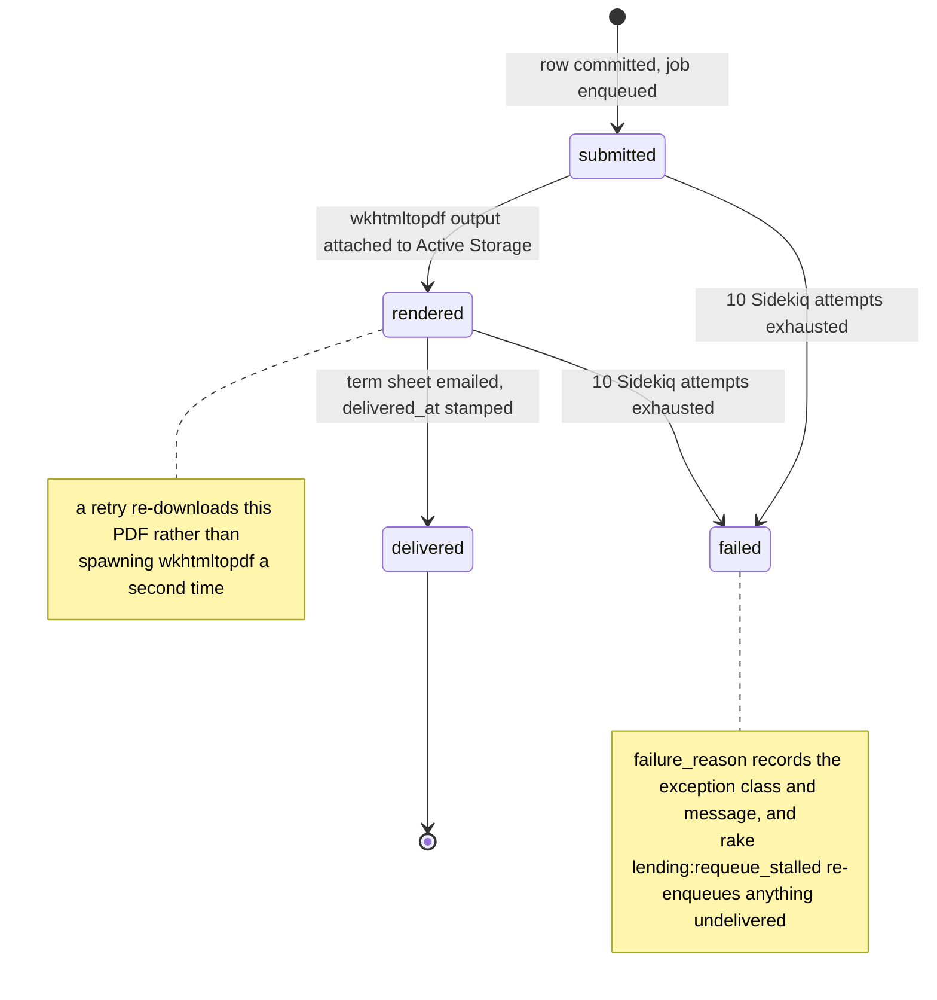

# Longleaf Lending

A borrower fills in a seven-step public form about a property they want to buy and rehab.
The server prices it against a lending product, shows them the figures immediately, then a
background worker renders a term sheet PDF and emails it.

No login, no dashboard, no admin area — the whole product is one form, the term sheet page it
redirects to, and the async pipeline in between. Rails 6.1, PostgreSQL, Sidekiq, `wkhtmltopdf`.

## The arithmetic is the point

This is a lending application. A figure that is wrong by a cent is not a rounding detail, it
is a number somebody is asked to sign. So the money code is specified rather than merely
tested, and `app/domain/lending/` is deliberately free of Rails, ActiveRecord, the network and
the clock so that specifying it needs no database.

**Floats are refused, not converted.** `Lending::Money.cast` raises `Money::FloatError` on a
`Float` instead of absorbing it — `0.9`, `0.7` and `0.13` have no exact binary form, so the
right place to fail is where the Float was introduced. `Lending::Product` applies the same rule
to the catalog YAML: an unquoted `0.13`, which Psych parses as a Float, is rejected with a
message telling you to quote it, which is why every rate in `config/lending_products.yml` is a
string.

**The two rounding directions differ, on purpose, and are asserted separately.** Policy caps
round *down* (`Money.floor_to_cent`) so no rounding step can lift an amount above the cap it
came from. The interest charge rounds *half-up* (`Money.round_to_cent`), because a rate
applied over a term rarely lands on a whole cent. `spec/domain/lending/money_spec.rb` pins
the pair in one example: `round_to_cent('99.999') == 100` while
`floor_to_cent('99.999') == 99.99`.

**The caps are proved unbreachable, not assumed.** `spec/domain/lending/quote_spec.rb` takes a
set of awkward amounts — `123_457`, `100_013`, `999_999`, `7`, `333_333` — and asserts the
funded amount is `<=` both raw caps for every one. A separate example points a `0.6667` ARV
cap at an ARV of `101`: `67.3367` must floor to **`67.33`**, because rounding to `67.34` would
put the loan above its own cap.

### One cent, pinned from both sides

Interest multiplies before it divides: `amount × rate × months ÷ 12`, never
`amount × (rate ÷ 12) × months`. The second form materialises a non-terminating monthly
rate and then re-rounds it. One example in `spec/domain/lending/quote_spec.rb` asserts the
correct `$6,500.85` on $100,013 over six months. The next one computes the wrong answer
deliberately and pins the gap:

```ruby
it 'is not what the naive monthly-rate-first expression produces' do
  naive   = (BigDecimal('100013') * (BigDecimal('0.13') / 12) * 6).round(2)
  correct = described_class.interest_expense(amount: 100_013, annual_rate: BigDecimal('0.13'), term_months: 6)
  expect(naive).to eq(BigDecimal('6500.84'))
  expect(correct).to eq(BigDecimal('6500.85'))
  expect(correct - naive).to eq(BigDecimal('0.01'))
end
```

Both numbers and the exact `$0.01` between them are in the suite, from both directions — the
naive form is named and shown to be wrong, and the right answer is asserted independently —
so the defect cannot return quietly under a different expression. `Lending::Quote` takes a
product and four numbers, touches nothing else, and every expectation written against it is
an exact decimal.

## What a borrower sees

**The form** — seven steps, one question at a time, priced by the server at the end.



**The review step.** The browser does no arithmetic: it posts to `POST /quotes` and renders what
comes back, so the preview and the PDF cannot disagree.



**The term sheet page.** Figures instantly, recomputed from the stored request rather than
waited on. Only the download waits for the worker, and the page polls (every 2s, up to 45
attempts) instead of asking the borrower to refresh.



**The PDF**, rendered by `wkhtmltopdf` inside the worker and emailed as an attachment — this
screenshot is the real generated document.



## From Submit to inbox

`wkhtmltopdf` spawns a process and takes hundreds of milliseconds to seconds; an SMTP round trip
can take longer and fails in ways worth retrying. Neither belongs in a request a borrower is
waiting on, so both sit behind the queue and the response returns as soon as the row is
committed.



### The four states a request can be in

`LoanRequest::STATUSES` is `submitted`, `rendered`, `delivered`, `failed`. `rendered` exists as
a state of its own because the expensive step and the flaky step share one job, and a bounced
mail connection must not cost another `wkhtmltopdf` run.



Retries are Sidekiq's exponential backoff over ten attempts, spanning a little over a day, which
covers a mail-provider outage. PDFs go to Active Storage rather than local disk, so the renderer
need not be the process that serves them (`ACTIVE_STORAGE_SERVICE=amazon` plus the `AWS_*`
variables makes it S3), and `spec/jobs/loan_processor_job_spec.rb` covers these paths.

## Running it

```bash
docker compose up --build
```

Brings up PostgreSQL, Redis, [Mailpit](https://mailpit.axllent.org/), the web process and
the worker, with healthchecks and `depends_on: service_healthy`; the web role owns migration
and seeding so the worker cannot race it. The form is at http://localhost:8280 and the term
sheet email lands in Mailpit at http://localhost:8283; PostgreSQL is on `8281`
(`longleaf` / `longleaf`) and Redis on `8282`. `docker compose down -v` drops the volume.

> **Docker status, stated plainly.** This repo's own build report records **Build verified:
> NOT RUN — deferred, RAM constraint** and **Boot verified: NOT RUN — deferred, RAM
> constraint**, with `docker compose config` parsing OK. A partial build before that
> deferral did fix two real defects still visible in the Dockerfile: Debian
> `bullseye-security` now indexes packages its pool no longer carries, so `apt-get install`
> 404s — hence the commented-out `snapshot.debian.org` source the base image ships for this
> case being enabled — and `ARG TARGETARCH=amd64` defeated BuildKit's automatic value,
> pulling an amd64 `wkhtmltox` `.deb` onto arm64, so that default is gone. The application
> itself was verified end to end *without* Docker, which produced the screenshots above.

Locally, without containers — Ruby 3.1.3, PostgreSQL, Redis, Node 18+, Yarn:

```bash
bundle install && yarn install
bin/rails db:prepare db:seed
bin/rails tailwindcss:build
bin/rails webpacker:compile          # NODE_OPTIONS=--openssl-legacy-provider on Node 18+
bundle exec sidekiq -C config/sidekiq.yml &
bin/rails server -p 8280
```

`wkhtmltopdf` is required — there is no PDF without it. It comes from the
`wkhtmltopdf-binary` gem, and `WKHTMLTOPDF_PATH` points at a system binary instead. In
development mail opens in a browser tab via `letter_opener`, with previews at
`/rails/mailers`.

```bash
bundle exec rspec                        # 274 examples
bundle exec rubocop
bin/rails lending:products               # print the catalog as the app reads it
bin/rails lending:requeue_stalled        # re-enqueue undelivered requests
```

The suite needs PostgreSQL and nothing else: it stubs the queue, the renderer and the mailer, and
`WebMock` refuses every non-localhost connection, so **no test can make a real API call.**

## Configuration

Read entirely from the environment. Nothing has a secret as its default and the app boots
with none of it set. `DATABASE_URL` overrides the `POSTGRES_*` set (`HOST`, `PORT`, `USER`,
`PASSWORD`, `DB`, plus `POSTGRES_TEST_DB`).

| Variable | Default | What it does |
| --- | --- | --- |
| `SECRET_KEY_BASE` | — | **Required in production.** Session and cookie signing. |
| `DATABASE_URL`, `REDIS_URL` | —, `redis://localhost:6379/1` | PostgreSQL URL (overrides `POSTGRES_*`) and Sidekiq's Redis. |
| `SIDEKIQ_CONCURRENCY` | `5` | Worker threads. One `wkhtmltopdf` process per busy thread. |
| `APP_HOST` | `localhost` | Host used to build URLs in mail. |
| `FORCE_SSL`, `RAILS_SERVE_STATIC_FILES` | `true` in production, unset | Drop TLS enforcement only when it terminates out of this app's sight; serve `public/` from Rails when nothing fronts it. |
| `ACTIVE_STORAGE_SERVICE` | `local` | `amazon` puts PDFs in S3, with `AWS_ACCESS_KEY_ID`, `AWS_SECRET_ACCESS_KEY`, `AWS_REGION` (`us-east-1`), `AWS_S3_BUCKET`. |
| `SMTP_ADDRESS`, `SMTP_PORT` | `localhost`, `25` | Production mail host. Also `SMTP_DOMAIN` (`longleaf.example`), `SMTP_USERNAME` (enables plain auth when set), `SMTP_PASSWORD`, `SMTP_STARTTLS` (`true`). |
| `MAILER_FROM` | `no-reply@example.com` | From address on the term sheet email. |
| `LENDING_PRODUCTS_PATH`, `STALLED_AFTER_MINUTES` | `config/lending_products.yml`, `15` | Where the catalog is read from, and the age threshold for `lending:requeue_stalled`. |
| `ANTHROPIC_API_KEY` | — | Enables the generated narrative. **Unset, everything still works.** |
| `ANTHROPIC_MODEL`, `ANTHROPIC_TIMEOUT_SECONDS` | `claude-opus-5`, `10` | Model, and connect/read timeout on that call. |
| `LENDING_EXPLAINER` | `auto` | `auto` picks Claude when a key is set; `rules` forces the deterministic explainer. |

## AI explains; it never decides a number

With `ANTHROPIC_API_KEY` set, Claude writes two or three sentences about *which lending cap limited
the loan and what the borrower could realistically change*. It is handed the already-computed
figures, it is **not** given the inputs to compute from, and it is instructed not to emit a digit.

Whatever comes back goes through `Lending::NumericGuard` first. Every numeric token in the
prose must match a figure the lending engine rendered, **including its unit** — `70%` and
`$70` are different claims and neither vouches for the other. One unrecognised token discards
the whole narrative and the deterministic explainer is used instead: no partial acceptance,
no repair step, because a figure that is nearly right is worse than one that is absent.

**Deterministic code owns every number, always.** The headline and the bullets — where all the
figures live — come from the quote and are never replaced by a model. With no key,
`LENDING_EXPLAINER=auto` resolves to `:rules` and the app behaves identically. The quote
preview deliberately never calls the generated explainer, because the borrower is waiting on
that response, and a test asserts it is not called even with a key set.
`spec/services/lending/explainers/claude_spec.rb` stubs the endpoint and covers the success,
refusal (`stop_reason: "refusal"`), HTTP-error and timeout paths, plus a narrative containing
an invented `$250,000` being discarded.

## Where the code lives

```
app/domain/lending/       # no Rails, no I/O, no clock — money.rb, quote.rb (all the
                          #   arithmetic), product.rb + catalog.rb (the seam), format.rb,
                          #   numeric_guard.rb, request_fingerprint.rb, explanation.rb,
                          #   explainers/rules.rb (deterministic, always available)
app/services/lending/     # thin, Rails-aware use cases — submit_loan_request.rb
                          #   (idempotency + enqueue), term_sheet_renderer.rb,
                          #   explainer.rb (registry, guard, fallback), explainers/claude.rb
app/jobs/                 # loan_processor_job.rb — render, store, email, idempotently
app/models/               # loan_request.rb — persistence and validation only
app/javascript/           # Stimulus 2 — form stepping and status polling
config/lending_products.yml    # the products. A new product is an entry here.
spec/domain/                   # the arithmetic specification
```

Dependencies point inward: controllers permit params, call a service and render, and
`LoanRequest` is a validation boundary whose `calculate_*` methods read off the quote.

## Decisions worth knowing about

**Products are data, and that is the extension seam.** A lending product — an LTC cap, an
ARV cap, a rate, a term window — is an entry in `config/lending_products.yml`. Nothing else
in the app knows a product code: the form renders what `Lending::Catalog` offers, the model
validates against it, the quote prices against whichever one it is handed, and the PDF prints
that product's caps. `spec/domain/lending/catalog_spec.rb` proves it by pointing the catalog
at a temporary file and pricing against a `heavy_rehab` product that exists nowhere in
`app/`. Three products ship — Fix & Flip, Bridge, New Construction.

**A submission is identified by its content, not its sender.** `request_fingerprint` hashes
applicant, property, product and figures under a unique index, so a double-clicked Submit or a
reload returns the original request and sends no second email; the race that beats the
read-before-write is caught by rescuing `RecordNotUnique`. The email column is indexed but *not*
unique, and `spec/models/loan_request_spec.rb` has an example named "lets the same applicant ask
about a second property" holding that open.

**Term sheets are addressed by an unguessable reference** (`SecureRandom.urlsafe_base64`), never
by the sequential id of a row holding applicant PII; `to_param` returns it.

**Term windows are enforced three times** — HTML input bounds, a model validation against the
product's own window, and a database check constraint (`loan_term_range`) wide enough for
every product offered.

**Rate limiting** via `rack-attack`: 5/minute per IP on `POST /loan_requests`, 30/minute on
`POST /quotes`, since every successful submission spawns a PDF process and sends mail. **`/up`
touches the database**, so a process that booted but lost its connection reports unhealthy
instead of lying to the orchestrator.

## What this does not do

- **No authentication and no admin area.** Deliberate — the product is the form — but a
  borrower who loses their reference URL cannot get back to their term sheet, and there is
  no way to list, search or underwrite requests.
- **No file uploads.** Extracting figures from an appraisal or a purchase contract is the obvious
  next step and is not built.
- **The quote is not an offer.** Nothing is underwritten, no credit is checked, no rate varies
  by borrower, and estimated profit ignores closing costs, carry, commissions and taxes. The
  term sheet says so.
- **Simple interest only** — no amortisation, no draw schedule, no points, no prepayment
  terms, all of which a real hard-money term sheet carries.
- **No Sidekiq web UI is mounted.** It would need authentication in front of it first.
- **The generated narrative is English only**, and the numeric guard's token rules assume `$` and
  `%`. A second currency or locale needs both revisited.
